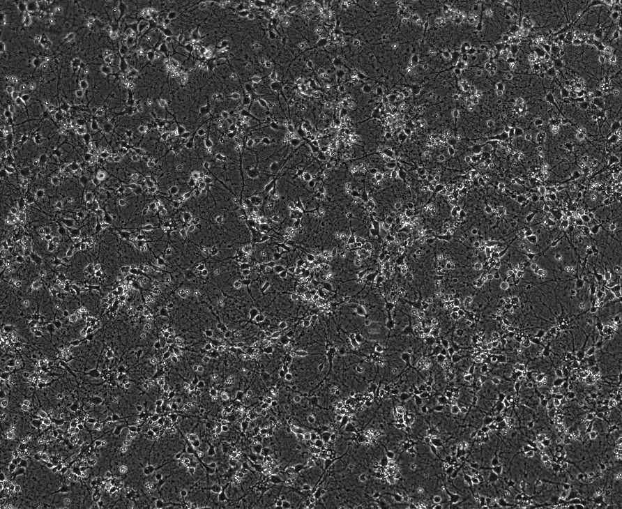
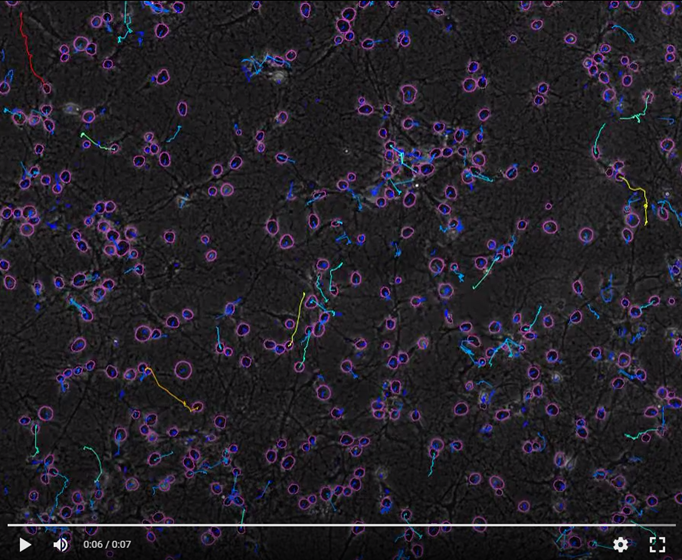

# Tracking microglial cells in brightfield rat cortical tricultures
## Introduction

These brighfield images have been obtained from imaging rat cortical cell tricultures with the method developed in this lab.

Paper describing the method can be found here: **Goshi, N., Morgan, R.K., Lein, P.J. et al. A primary neural cell culture model to study neuron, astrocyte, and microglia interactions in neuroinflammation. J Neuroinflammation 17, 155 (2020). https://doi.org/10.1186/s12974-020-01819-z**

Broadly, these tricultures are composed of 
-  Neurons
-  Astrocytes
-  Microglia

The feat of this paper is to have found a media without serum (toxic to neurons) that can still support microglia cell function.
Tricultures of rat neurons, astrocytes and microglia allow for the study of crosstalk between the three essential components of the central nervous system (CNS) in mammals. Microglial cells have previously been described as the main immune defense of the CNS. They are resident macrophages which are crucial to the maintenance of the CNS homeostasis and must react quickly in the presence of pathogenic agents and aggregating peptides. As such, microglial cells can adopt an amoeboid-like shape to quickly move through neurons as scavenger cells and digest unwanted materials before extensive damage happens to the tissue.

In their amoeboid shapes, these cells can be seen to move in the tricultures the Seker lab is using as models to explore neuroinflammation, neurodegeneration and other disorders that may occur in the CNS. However, the current method to track these moving cells involves identifying and tracing them by hand in each video taken with the microscope to generate tracks with a ImageJ plugin.

For this rotation, we would like to change the cell detection method from manual to automated. We are planning to train and use a neural network to recognize our cells. Additionally, we would like to use Cellprofiler to track these detected cells and develop a script that could take the generated track tables and output a few summary graphs containing the number of cells tracked, their phenotype and their speeds.

### Main figure for co vs tri-culture

## Challenges
**For segmentation**

1.  The supplied data are brighfield images with no markers to help segmentation or cell type identification (example below)
-  Common segmentation methods will not work (thresholding, watershed...)
-  The cells are crowded
-  The background in the well can look like it's scratched because the cells are on a microchip-type support, used to do electrotaxis which shows up in the imaging as blurry scratches
-  The images progressively slide down during imaging (can be corrected but was not adressed in the timespan I spent on this project)

2.  Neuronal cell morphology is extremely variable and, even by eye, it is hard to tell which dendrite ends where so training a model is not doable
3.  In their amoeba-like state, microglial cells can sometimes look like big dendrites
4.  Cells are unhappy in electrotaxis conditions, you can see them changing phenotype

**For tracking**

1.  Microglia sometimes move erratically (in speed and in direction), nearest-neighbor assumption is not an option
2.  Cells can get lost from one frame to another

## Strengths

1.  None of these cells divide, I don't have to worry about lineage tracing
2.  The only cells that move a certain distance **can only** be microglia, I can do filtering based on track length over the 50 frames

# Avenues explored and subsequently abandonned

-  celltracker (used inside of CellProfiler): Hu T, Xu S, Wei L, Zhang X, Wang X. CellTracker: an automated toolbox for single-cell segmentation and tracking of time-lapse microscopy images. Bioinformatics. 2021 Apr 19;37(2):285-287. doi: 10.1093/bioinformatics/btaa1106. PMID: 33416830.

Abandonned because the resulting segmentations were quite bad. Additionally, there isn't a lot of documentation on how to extract data from the tracks and the gui is deprecated. Cellpose can be used in it but no video output with the masks and the tracks are possible.

-  ultrack: https://github.com/royerlab/ultrack/tree/main

Abandoned because their test data sets do not include brightfield images without markers and also, the interaction with their program through Gurobi was too steep of a learning curve for a 5 weeks project.

# Final pipeline

I ended up training my own model using the cellpose gui : Stringer, C., Wang, T., Michaelos, M. et al. Cellpose: a generalist algorithm for cellular segmentation. Nat Methods 18, 100–106 (2021). https://doi.org/10.1038/s41592-020-01018-x

For tracking, I used the trackMate ImageJ plugin : Ershov, D., Phan, M.-S., Pylvänäinen, J. W., Rigaud, S. U., Le Blanc, L., Charles-Orszag, A., … Tinevez, J.-Y. (2022). TrackMate 7: integrating state-of-the-art segmentation algorithms into tracking pipelines. Nature Methods, 19(7), 829–832. doi:10.1038/s41592-022-01507-1

ImageJ integrates both cellpose and trackMate, very conveniently.

First I used the model I trained to segment my images in ImageJ + the TrackMate plugin while using the following parameters:
-  mask width on average = 25
-  number of successive frames where the object can be lost: 10
-  exclude cells that touch the border: yes
-  tracking algorithm: simplified LAP with default parameters

Once the tracks are produced, I output
-  A video of the 50 frames + each ROI on each frame + tracks colored by total distance traveled (red = highest distance in the image)
-  A table containing information on each ROI
-  A table containing information on each track

Then I made a R script to output various graphs of interest
-  Tracks plot
-  Spider plot
-  Statistical analysis on multiple parameters such as : Average speed, directionality, distance...

**Zoomed-in triculture well after segmentation and tracking**

**Spider plot examples**

# Nota Bene

This README doc is missing details about parameters and how to install the various softwares used as well as the model I used.
If I don't come back to it, please contact me at mhardy@ucdavis.edu 

